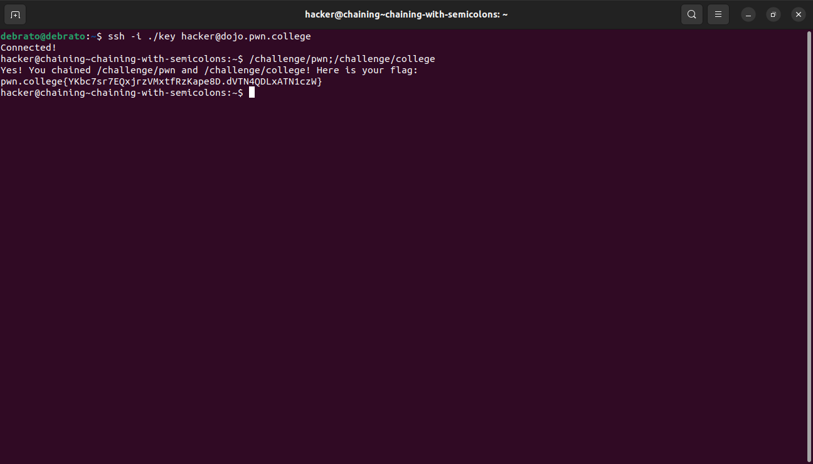
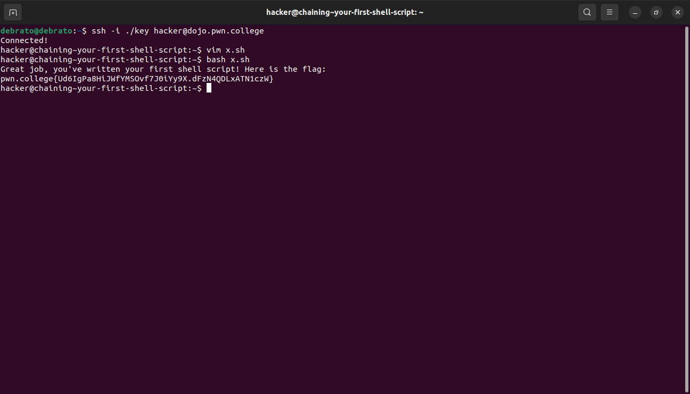
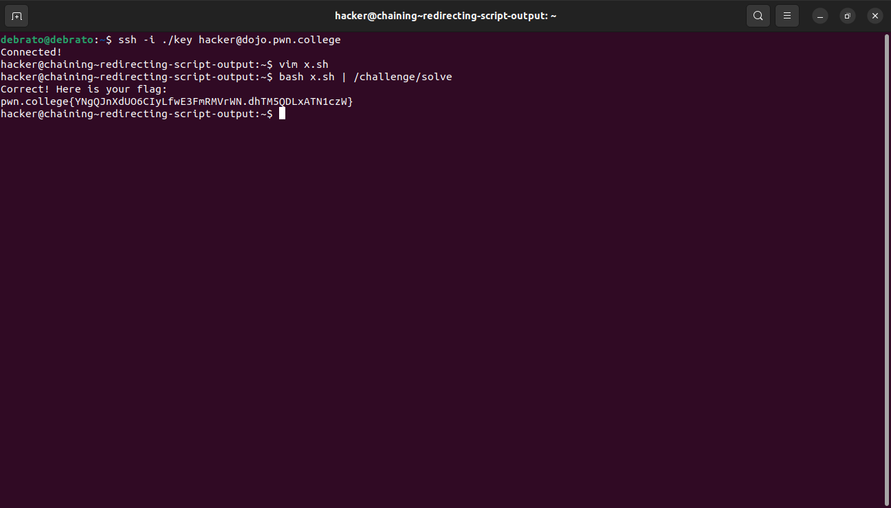
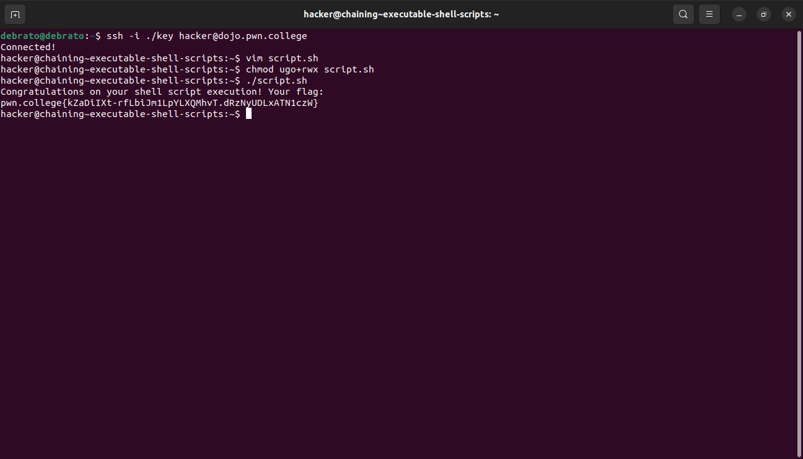

# Chaining Commands
This is my eleventh module. I had already studied about chaining of commands, lets see how the challenges goes

## Chaining with Semicolons
This challenge taught me how to chain commands using ;

## Your First Shell Script
I had to first make a .sh file a shell script, then execute it using bash.

## Redirecting Script Output
This challenge was like previous challenge here additionally I just had to use piping.

## Executable Shell Scripts
In this we had to use all previous concepts to get the flag.

