# Comprehending Commands
This is the third module with 12 challenges, till now the taskphase challenges are going chill because i spent a large chunk of previous fe days learning about the unix command line. This module was very easy because it had all the basic commands which you get to know when you start learning about unix command line on cli.

## cat: not the pet, but the command!
In this challenge, I had to use the cat command to read the data of flag file, it was easy bcz i knew the basics of unix command line. I had first thought to use ls to view all files in home ~ directory because it was told so in the instructions, then on using cat flag it read the contents which contained the flag.
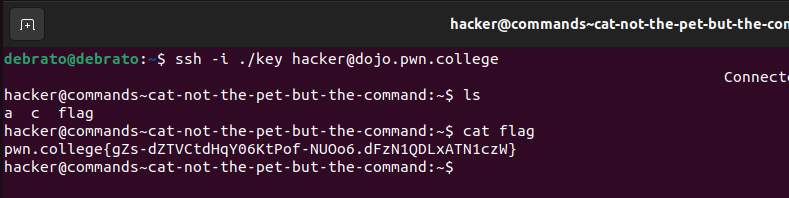

## catting absolute paths
This was the same challenge as the first challenge in this module just this time we had to use the absolute path.
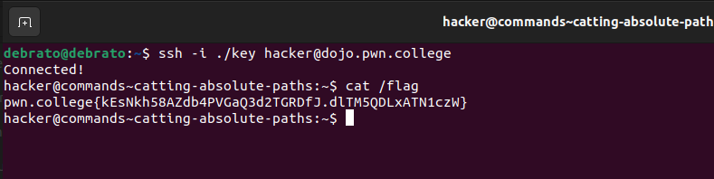

## more catting practice
In this challenge, the instructions has said that we cannot use cd therefore we need to use the absolute path of flag file to retrieve the flag. They made the challenge easy by already giving the absolute path, if they hadnt given we could have used find or used ls to check and find out the flag file.
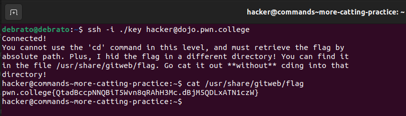

## grepping for a needle in a haystack
I knew about the grep command, but I used it for the first time , here i just tried to see how big the file was using cat because they told it was big. I used grep command with pwn.college because flag is always beginning with that according to the instructions.
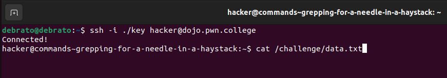
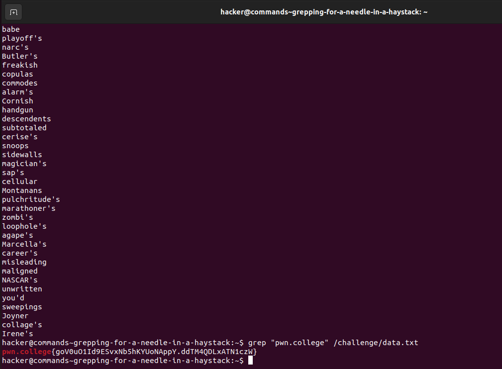

## listing files
This was the most basic challenge, beacuse ls was the first command I had learnt while learning the unix command line. It only required me to use ls and find out the name of the file and then execute it.
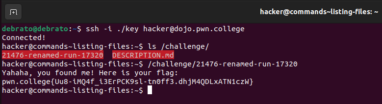

## touching files
This challenge just asked me to create tmp/pwn and /tmp/college, and run /challenge/run to get the flag. In this we had to go to tmp directory and create the given two files, then run the given absolute path the get the flag.
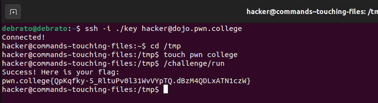

## removing files
This just required me to delete a file then run the path to get the flag, nothing much to say.
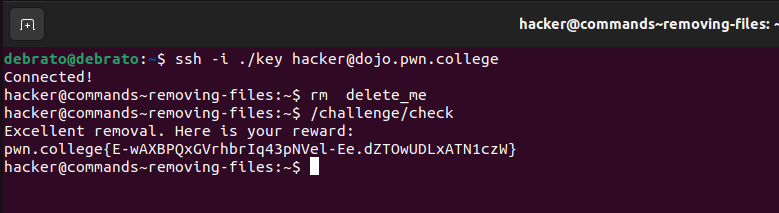

## hidden files

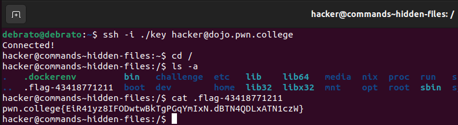

##

##

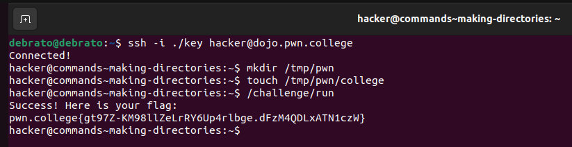

##

##

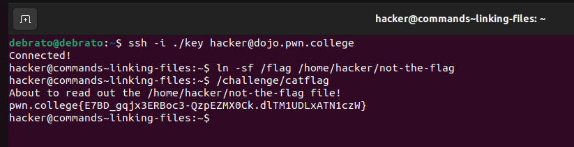

