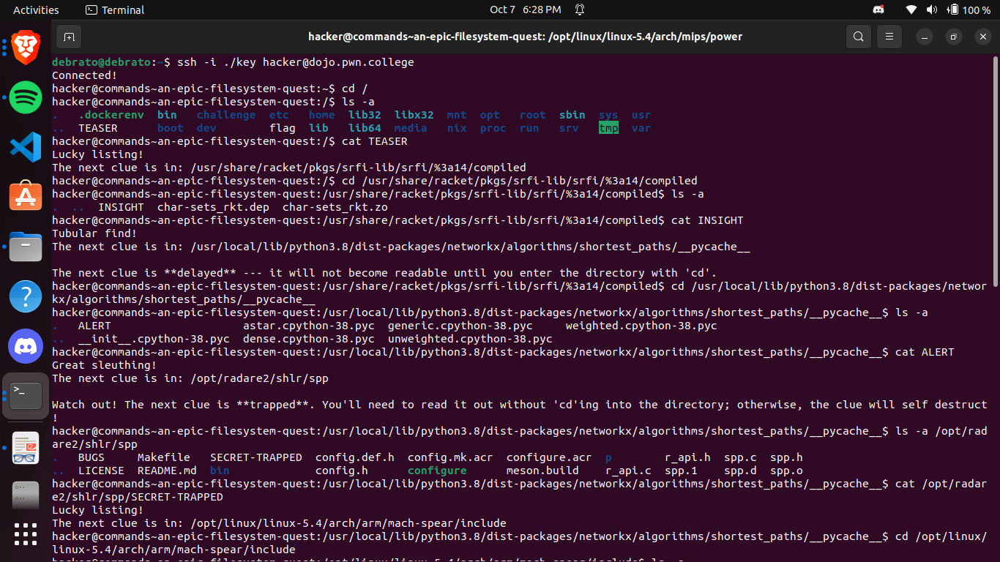
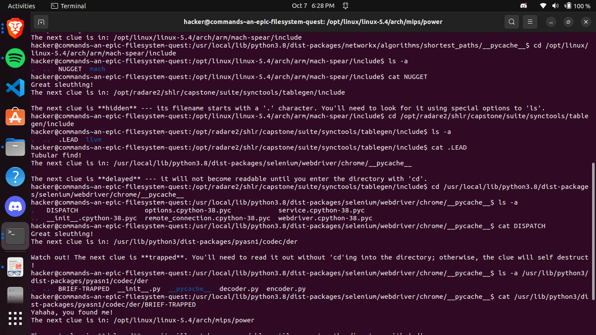
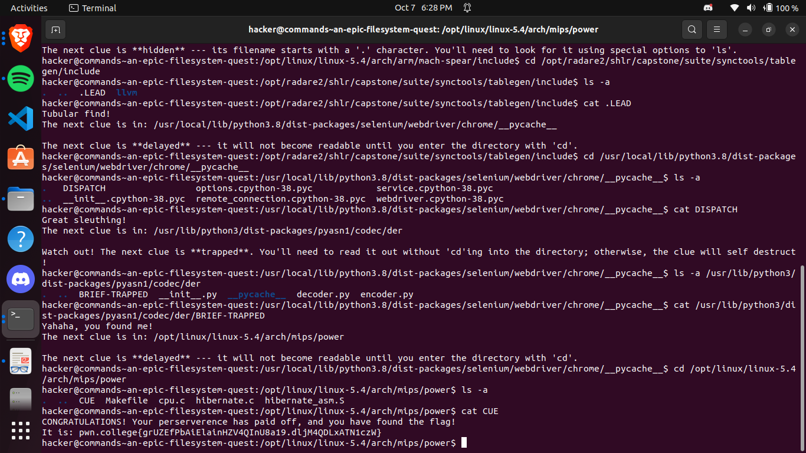
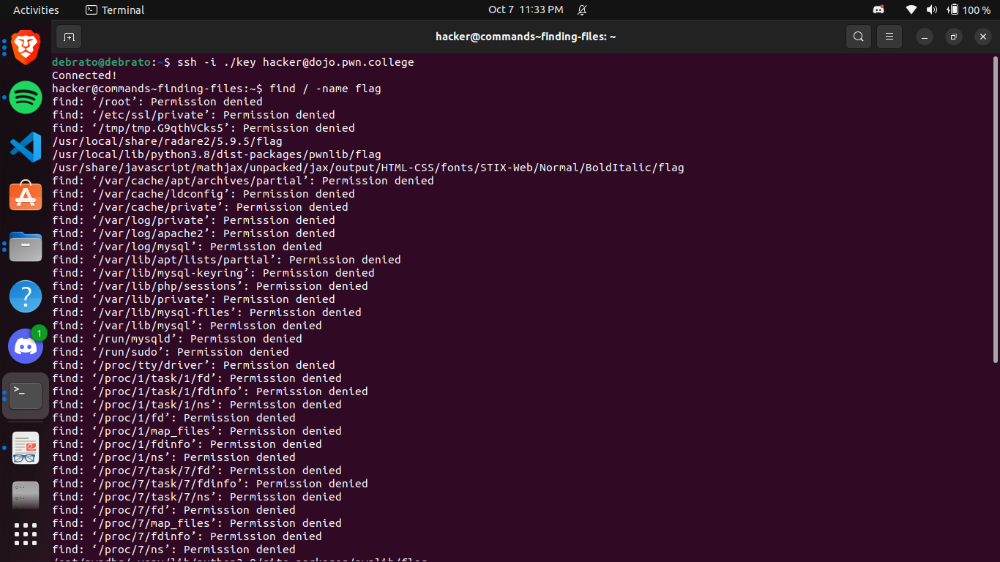
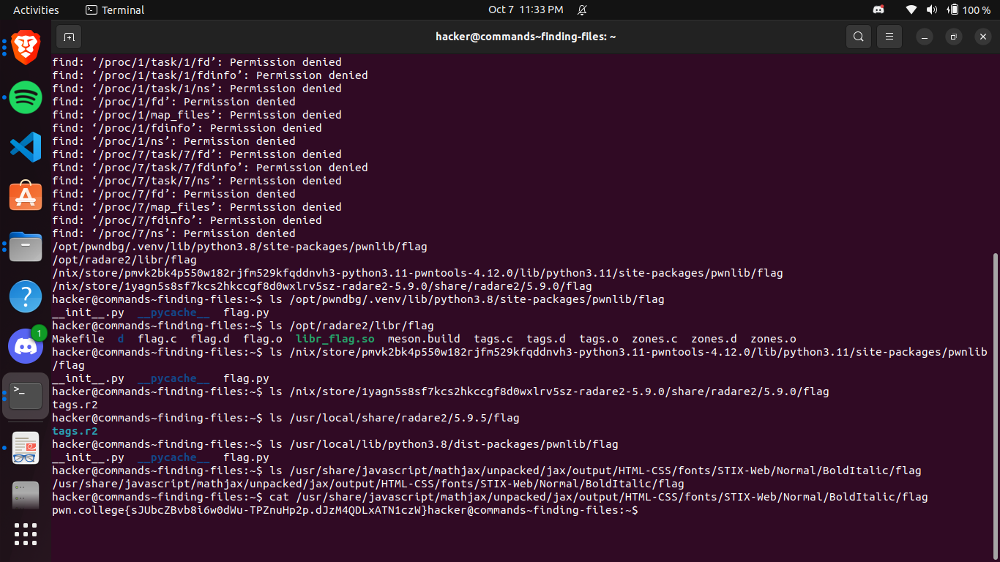

# Comprehending Commands
This is the third module with 12 challenges, till now the taskphase challenges are going chill because i spent a large chunk of previous fe days learning about the unix command line. This module was very easy because it had all the basic commands which you get to know when you start learning about unix command line on cli.

## cat: not the pet, but the command!
In this challenge, I had to use the cat command to read the data of flag file, it was easy bcz i knew the basics of unix command line. I had first thought to use ls to view all files in home ~ directory because it was told so in the instructions, then on using cat flag it read the contents which contained the flag.

## catting absolute paths
This was the same challenge as the first challenge in this module just this time we had to use the absolute path.

## more catting practice
In this challenge, the instructions has said that we cannot use cd therefore we need to use the absolute path of flag file to retrieve the flag. They made the challenge easy by already giving the absolute path, if they hadnt given we could have used find or used ls to check and find out the flag file.

## grepping for a needle in a haystack
I knew about the grep command, but I used it for the first time , here i just tried to see how big the file was using cat because they told it was big. I used grep command with pwn.college because flag is always beginning with that according to the instructions.

## listing files
This was the most basic challenge, beacuse ls was the first command I had learnt while learning the unix command line. It only required me to use ls and find out the name of the file and then execute it.

## touching files
This challenge just asked me to create tmp/pwn and /tmp/college, and run /challenge/run to get the flag. In this we had to go to tmp directory and create the given two files, then run the given absolute path the get the flag.

## removing files
This just required me to delete a file then run the path to get the flag, nothing much to say.

## hidden files
This challenge was also simple, I just had to l -a then use cat to read the flag file for flag.

## An Epic Filesystem Quest
This problem was just lengthy, repeating the concepts, key concept in that accessing the file without cd was using ls with the given absolute path and then cat with the given absolute path with the file.

## making directories
In this challenge I just had to create a directory then create a file and then running an absolute path to get the flag. We can also use dabsolute path with mkdir and touch.

## finding files
This was a bit tediois because it gave many absolute paths, I thought I would first list all directories using ls, then try my luck checking each flag. At first I got confuesd because i wasnt getting the flag then I saw i was missing 2 paths among all the permission denied ones, then i tried the same with them with the second path when I uswd ls i got the same path printed back to me which meant it directed to a file and not adirectory and on reading that file I got the flag. 

## linking files
In this challenge I was getting confused that should the I link the content of /challenge/catflag  to file.txt which gave the output /home/hacker/not-the-flag ie my idea was wrong then i thought of linking the /flag to /home/hacker/not-the-flag so that when i run /challenge/catflag it would invoke/home/hacker/not-the-flag and which in turn would give me the flag. I was getting error when I was using ln -s, it was saying that the file not-the-flag already exists, so on finding more about this I got to know about the -sf flag in which the -f flag would overwrite the existing file at /home/hacker/not-the-flag.

