# Digesting Documentation
This is the fourth module with 7 challenges. Till now the challenges have been okay because they are teaching pretty basic stuffs.

## Learning From Documentation 
In this challenge we just had to invoke the given path with the given argument.
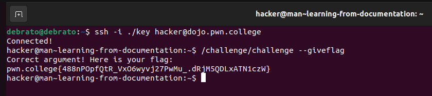

## Learning Complex Usage
In this challenge they told to access any file i need to invoke /challenge/challenge with --printfile flag with argument as the path, i first tried opening the doc file as mentioned in the instructions, which gave the same instructions set. THn i tried to find all paths conating file named flag using find command, at first i was seeing many paths i was trying thrm but then I saw directly /flag path and then i directly followed the instructions set.
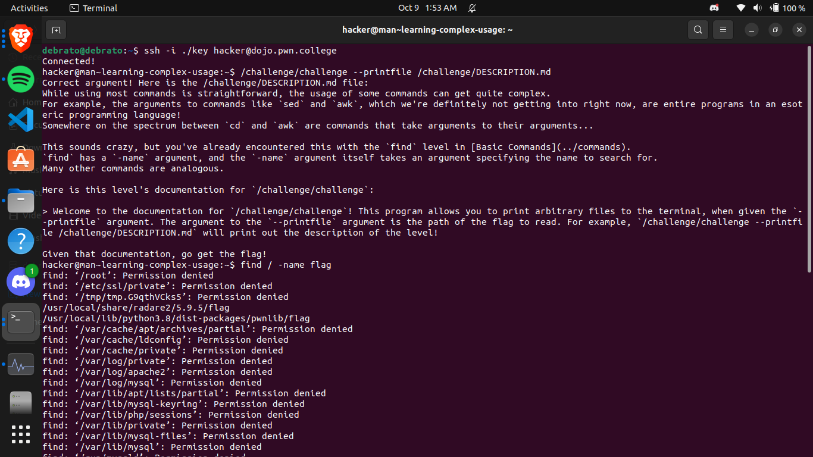
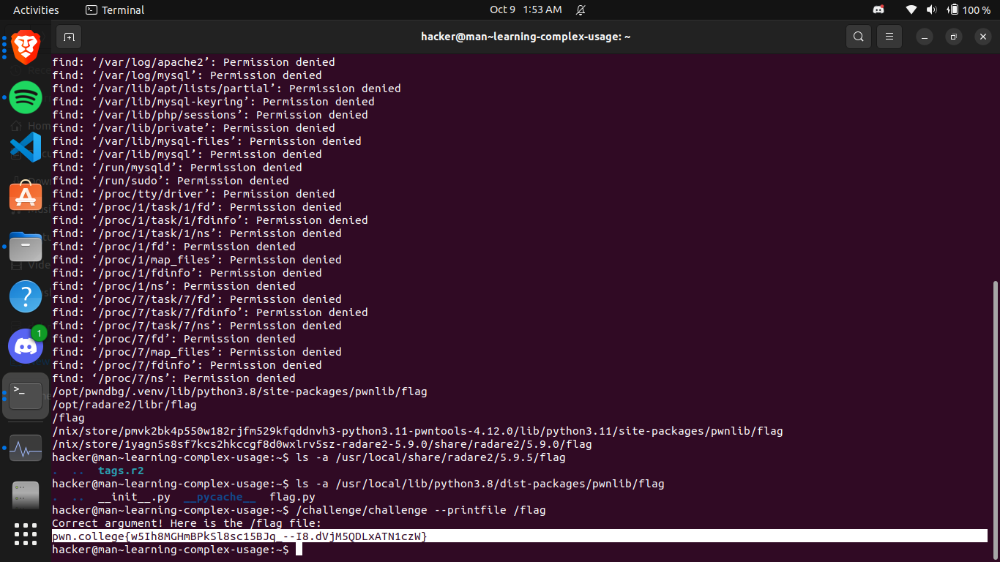

## Reading Manuals
In this challenge I got to know about the man command and we dont use paths as command for it.
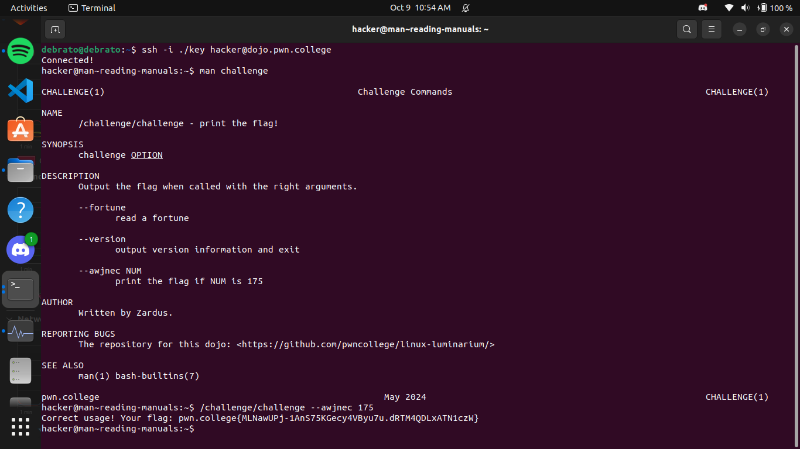

## Searching Manuals
In this i got to know how to search inside the man pages using  /,?,n,N etc.
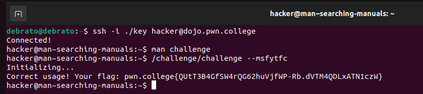
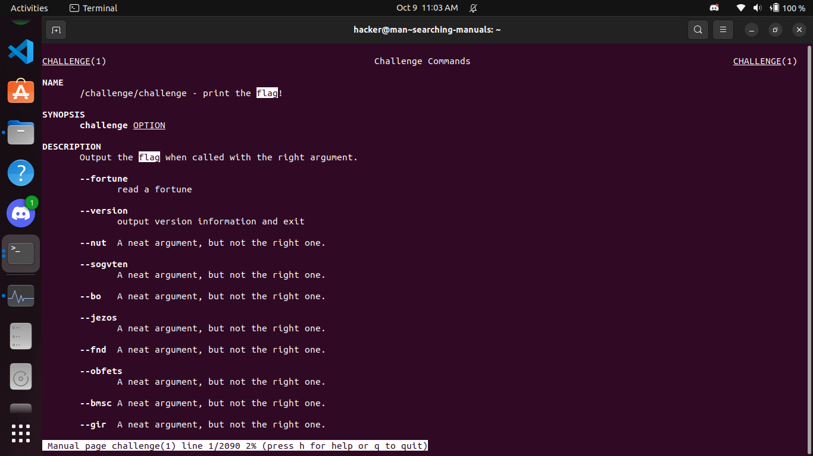
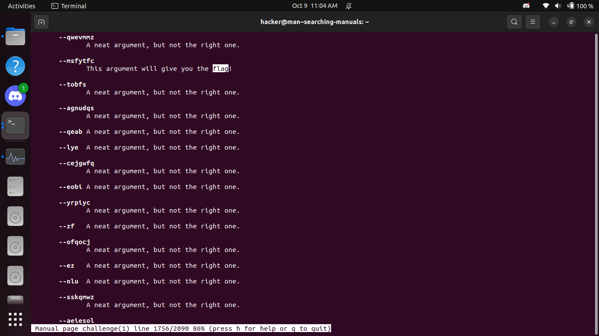

## Searching For Manuals
I got to do we can do man man too. I learned to search a man page we can use -k or --apropos , then like in previous challenges we go to the man page then see the documentation and invoke aptly for the flag.
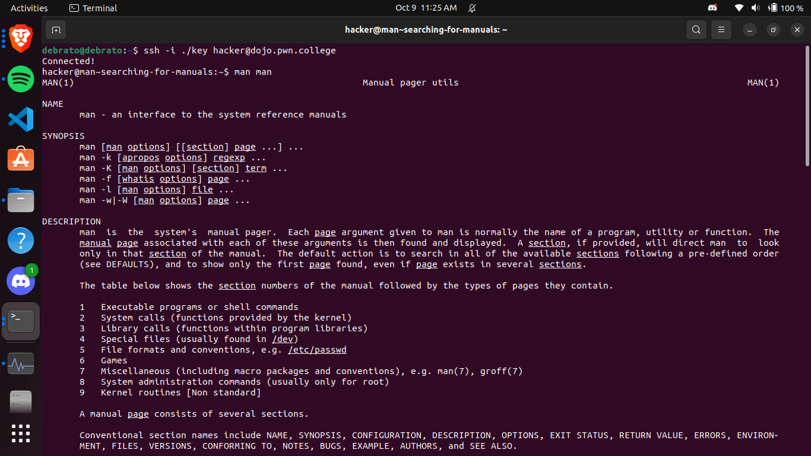
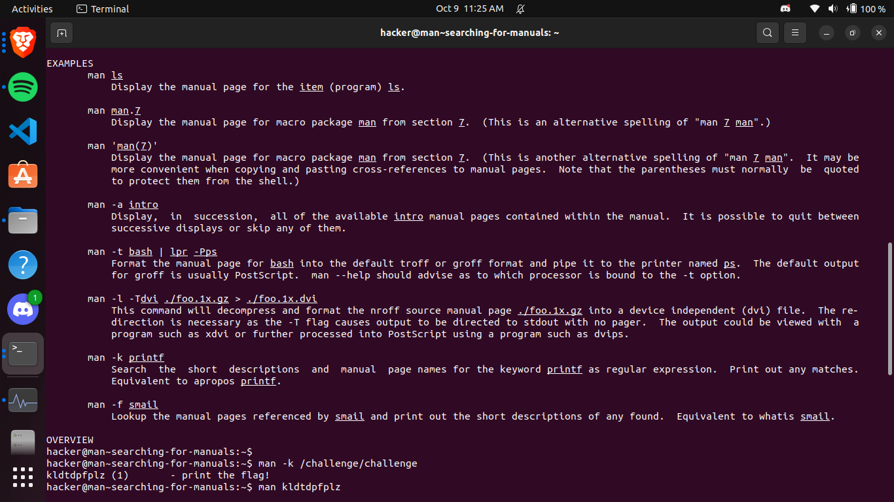
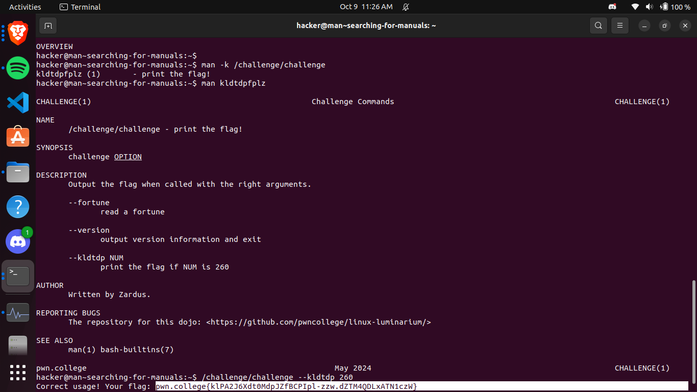
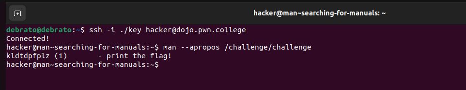

## Helpful Programs
This challenge was interesting and fun, first I wasnt getting what program to use --help with then i thought it might be /challenge/challenge then it told me to use -p to get an argument which i have to use with -g to get the flag.
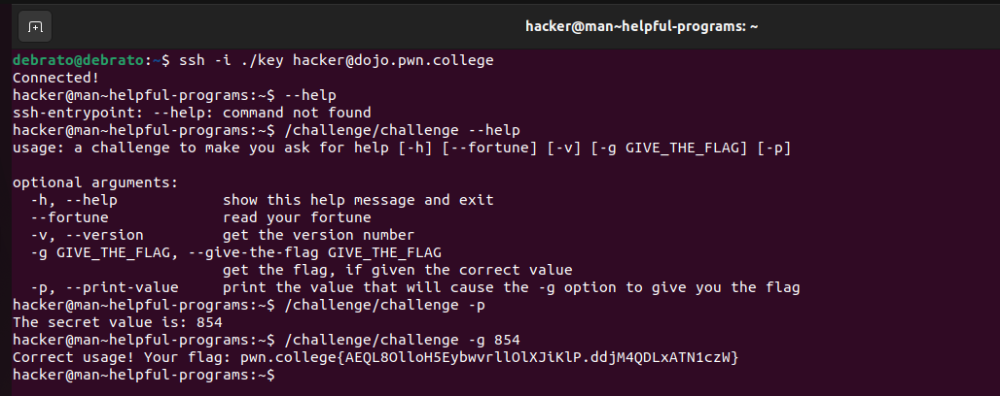

## Help For Builtins
In this challenge I got to know about the help command which gives all the built in commands and on invoking help command we get all information about it, here I got the information about challenge command then i executed with its flag with the given apt argument flag to retrieve the flag.
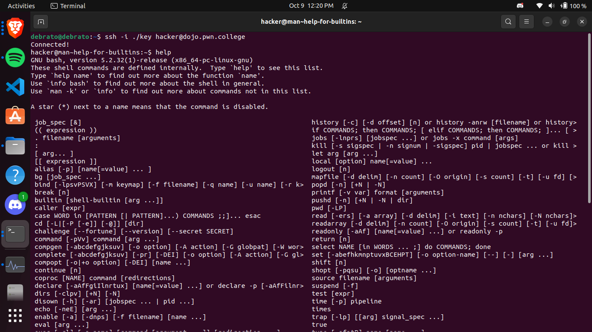
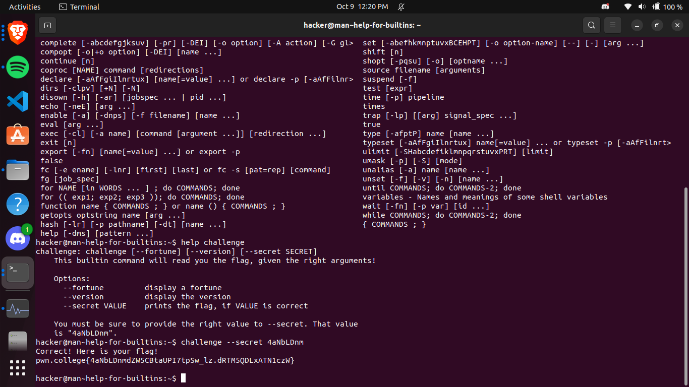

