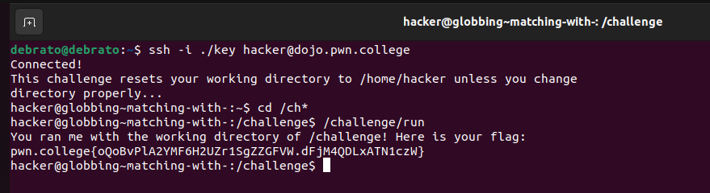
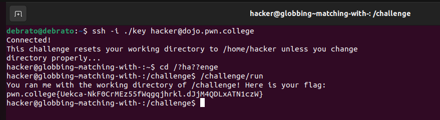
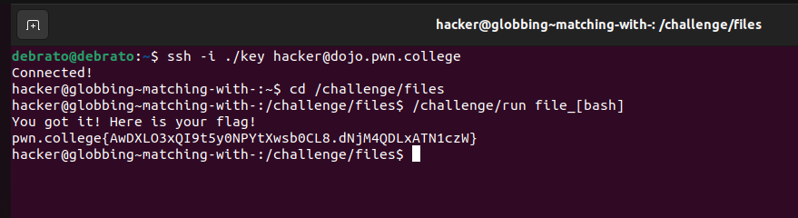
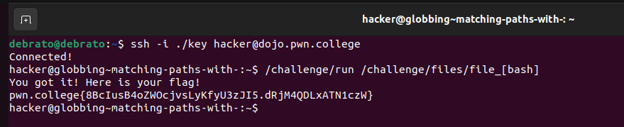
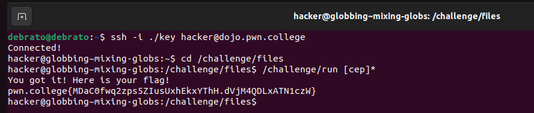
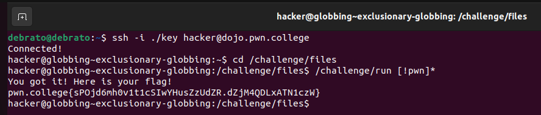

# File Globbing
This is the 5th challenges with 6 challenges. I already know about file globbing but lets see how the module goes and what all new things I learn.

## Matching with * 
In this challenge, I revised the file glob * which can replace as many characters required to find the files. In this chalenge I had to change directory using four characters therfore I used file glob's help, then on reaching the directory it had asked me to invoke a path which I did to get the flag.

## Matching with ?
In this challenge everything was already spoonfed like replacing c and l with ? and then invoking the path like the previous challenge.

## Matching with []
This challenge was also easy here I just had to cd the directory and then invoke the given path with a single argument, herefore I used file_[bash].

## Matching paths with []
Inthis cahllenge ww did the same thing like previous challenge but we didnt cd to the challenge directory because it wasnt mentioned in instructions and for the argument of /challenge/run we used absolute path with file glob [].

## Mixing globs
This took some time, I was at first thinking something in the lines of * [] therefore wasted some time on it, then it clicked to me that it should be [] * because * file glob would try to replace the characters after the first words therefore [cep] * worked. 

## Exclusionary globbing
This used the same concept as the last challenge, we just had to use ! to exclude files starting from p,w,n.

