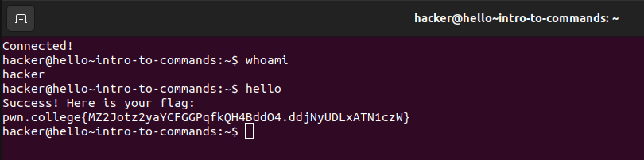
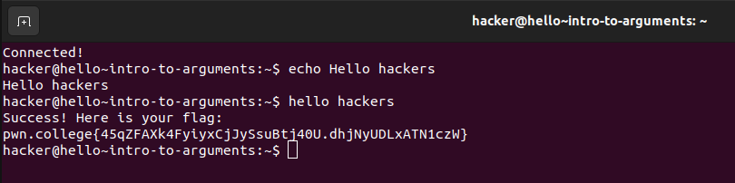

# Hello Hackers
This is my first module. I took plenty time before my first module to learn about the unix command line after dualbooting linux so the first module was easy for me

## Intro to commands
This part was pretty straightforward they just wanted me to print the username using whoami command and then just invoking helo command which I dont think actually exists. then i easily got the flag and i submitted it to the pwn.college website.

## Intro to Arguments
This part was also simple only because it just taught about the echo command which prints the argument, but to capture the flag they didnt even require the echo command they just wanted us to run the hello hacker command which in turn gave the flag which I uploaded.

