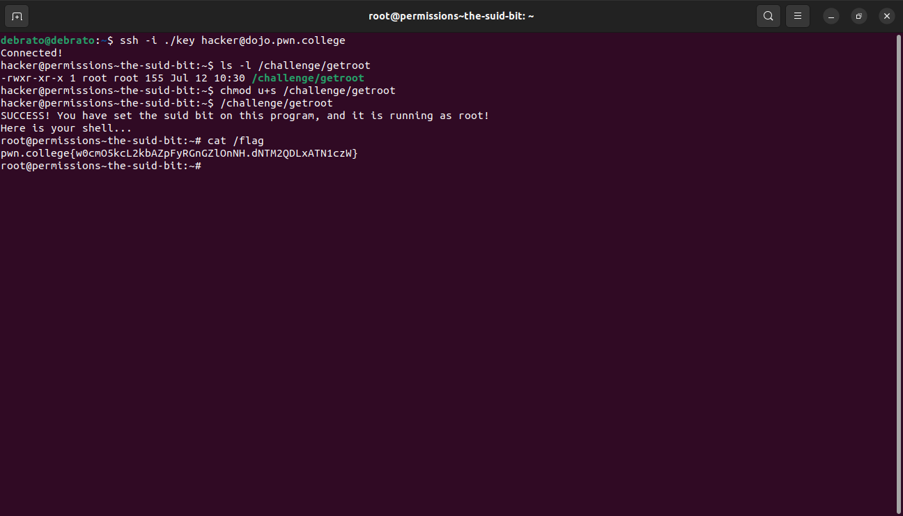

# Percieving Permissions
This is my nineth module. I dont know much about percieving permissions. Till now its been easy to learn even the new things lets see how this module goes.

## Changing File Ownership
In this challenge I learned to use chown, it is used to change ownership of file, we generally require root access to use chown.

## Groups and Files
In this challenge I learnt about chgrp, it is used to change the group ownership, as said previously for chown it also requires root access.

## Fun with Group Names
In this challenge I had to check the group  my user is part of using id command then change to that group then access and read the file.

## Changing Permissions
In this challenge I learnt about changing permissions using chmod and its different options and how to use it.

## Executable Files
In this challenge we used the same concept as the previous one.

## Permission Tweaking Practice
Reading the instructions I knew this challenge is going to be long. Same concept but just lengthy.

## Permissions Setting Practice
Same concept like last chalenge pretty lengthy.

## The SUID Bit
This challenge told me about SUID bit and how any user can execute it if its is in place of executable bit.I was stuck for a while because I wasnt executing the given program and directly trying to read the file.

