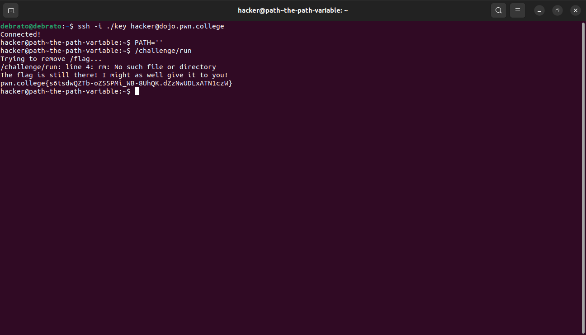

# Pondering PATH
This is my twelveth module. I had already studied about Paths had done some challenges too, but I have to learn about this PATH variable thing, lets see how the new challenges goes

## The PATH Variable
In this challenge we blank the PATH variable and run /challenge/run.

## Setting PATH
In this challenge we have to change the PATH with directory of win command and run /challenge/run.

## Adding Commands
This challenge is a tricky challenge as we have to first create a shell script win.sh with cat/flag command in it but also give change its permission to be executable by chmod after which we have to rename it to win so that it could be executable command win.

## Hijacking Commands

