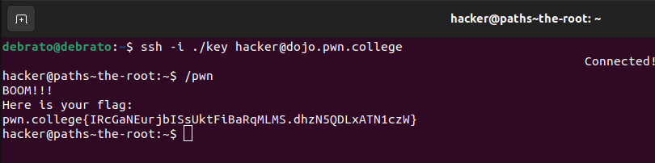
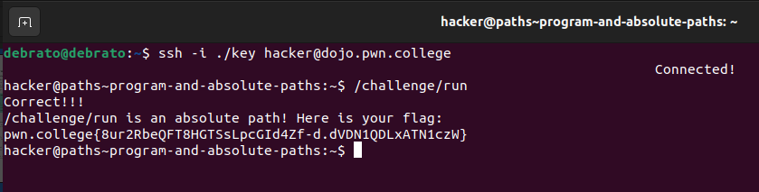
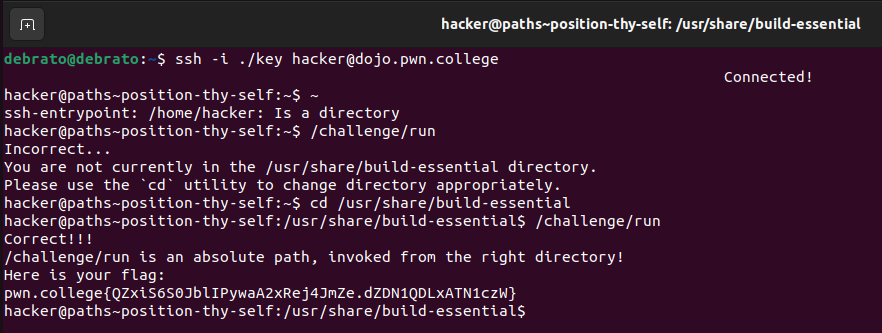
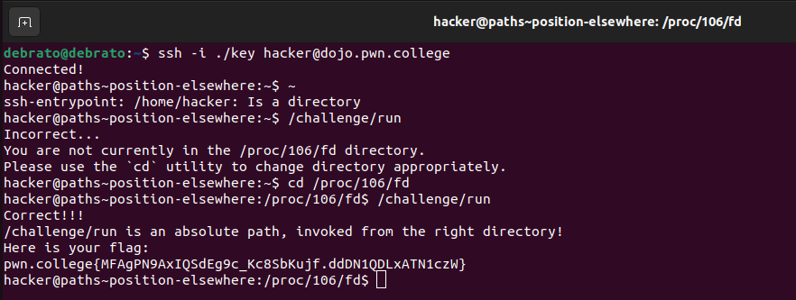
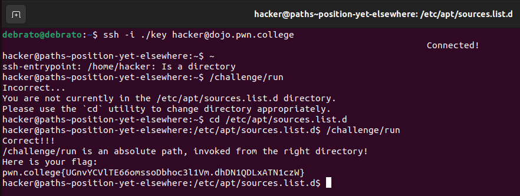
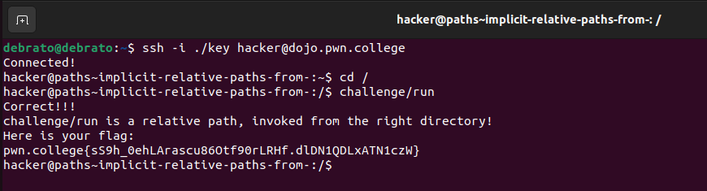
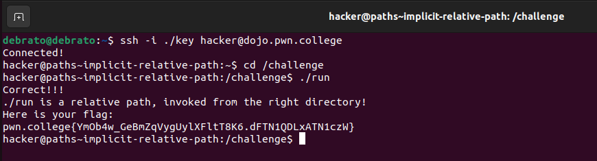
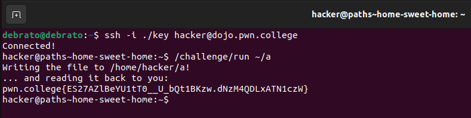

# Pondering Paths
This is my second module. I took plenty time before my first module to learn about the unix command line after dualbooting linux so this too was kind of easy for me, only sometimes the wording of the instructions was confusing.

## The Root
This part just required me to write/pwn  to invoke it, it was an absolute path. Pretty straightforward I already knew about this.

## Program and absolute paths
Herealso i just had to run/ invoke the given absolute path nothing else, basic stuff.

## Position Thyself
This challenge was okay, it confused me at the beginning due to its beginning then I thought that I should just try invoking the given absolute path, I got incorrect error but got the directory path where I had to invoke the given absolute path.

## Position elsewhere
This challenge was done in the similar way as the 3rd challenge in this module the instructions were same too, just the directory got after getting incorrect changed.

## Position yet elsewhere
This challenge was done in the similar way as the 3rd and 4th challenge in this module the instructions were same too, just the directory got after getting incorrect changed.

## Implicit relative paths, from /
I knew about relative paths but i got to know that they are also called as naked paths. While writing the code i needed to go to / ie root directory then invoke the given relative path.

## Explicit relative paths, from /
I knew about . and .. usage but i didnt do it deeply so while doing this challenge I learned more about this. The . and .. are used in explict relative paths only.

## Implicit relative path
This part confused me a bit due to its wording, here I had to go first to challenge directory then do the same as the challenge 8.

## Home sweet home
This was a bit confusing i was first thinking something else, then i thought it was pretty straightforward according to the instructions. It just wanted to invoke the given /challenge/run with an argument which will be an absolute path but should be 3 char or less and inside home directory, so i used ~/a, which would be 3 characters and complete absolute path too.

