# Practicing Piping
This is the 6th challenges with 11 challenges. Till now everything has been going fine lets see what this module brings to the table.

## Redirecting output
The first challenge was easy it just taught how to redirect stdout to files using >.
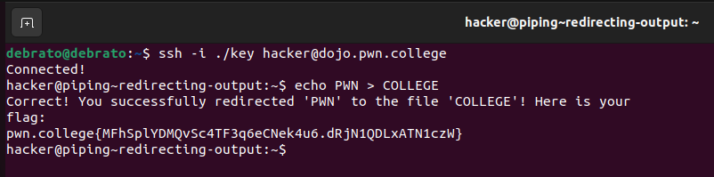

## Redirecting more output
This challenge was similar to the last challenge, here additionally I just had to print the myflag file.In the challenge, you’re tasked with redirecting the output of the /challenge/run command to a file named myflag. But you’ll notice something unexpected: even after you redirect the output, some information from /challenge/run is still shown on the terminal.
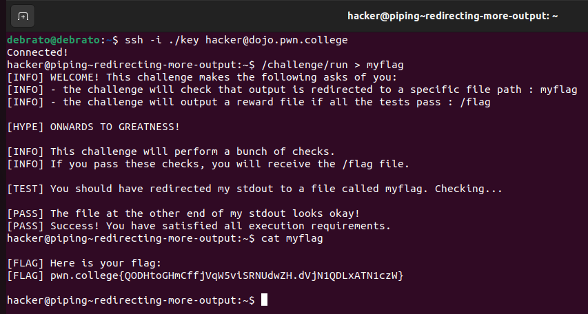

## Appending output
I actually found a bug in this challenge I guess because when i directly used cat on the given path it directly gave me the flag.
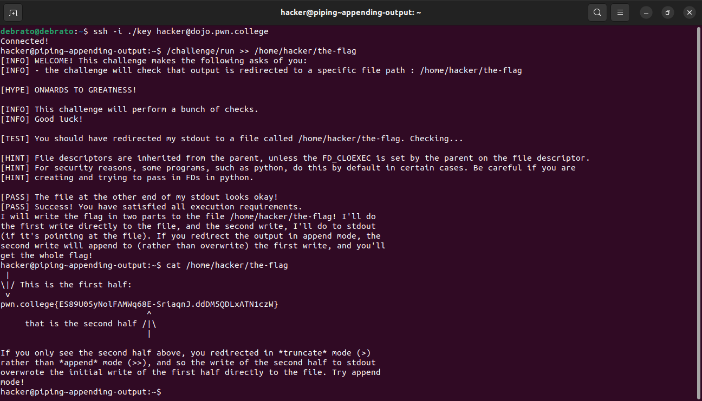
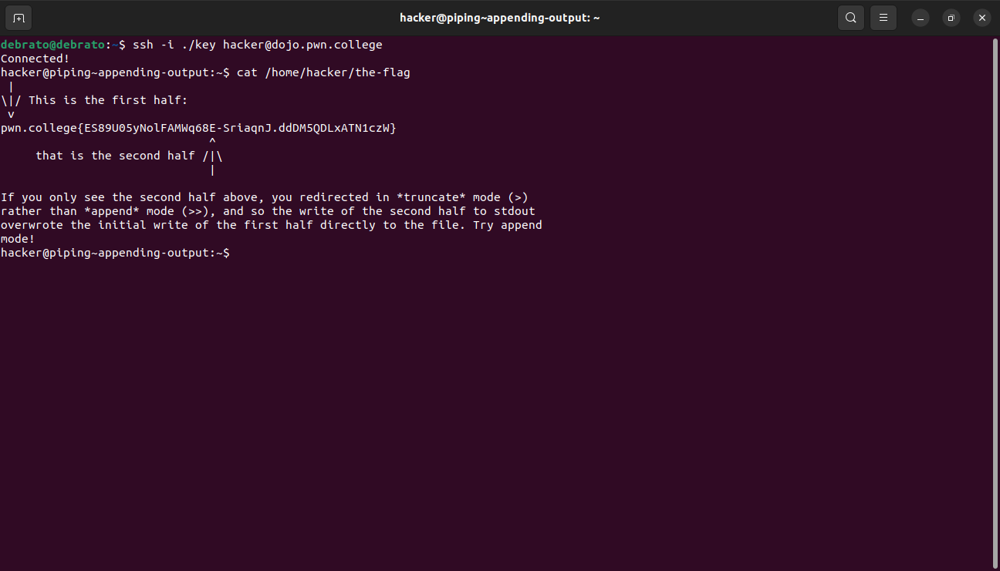

## Redirecting errors
This challenge was simple followed same logic as before  just here we used multiple > and files at the same time one for output and one for errors.
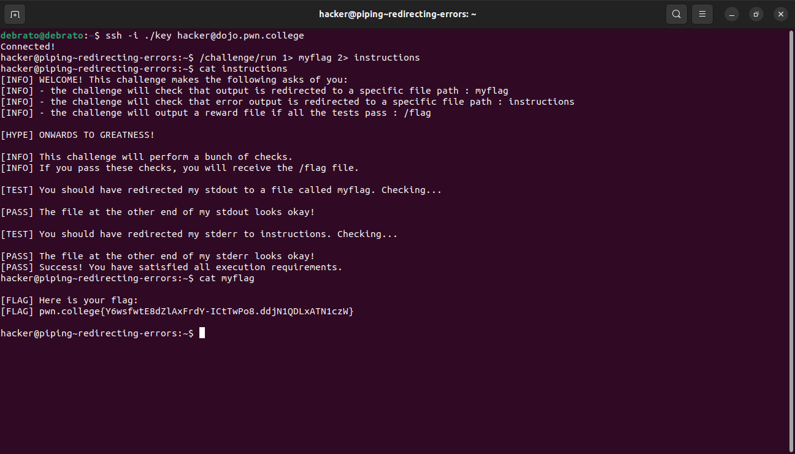

## Redirecting input
In this i just had to store literally COLLEGE in PWN file first i was thinking COLLEGE as a file, then i used echo command for it and then followed the given instructions for the flag.
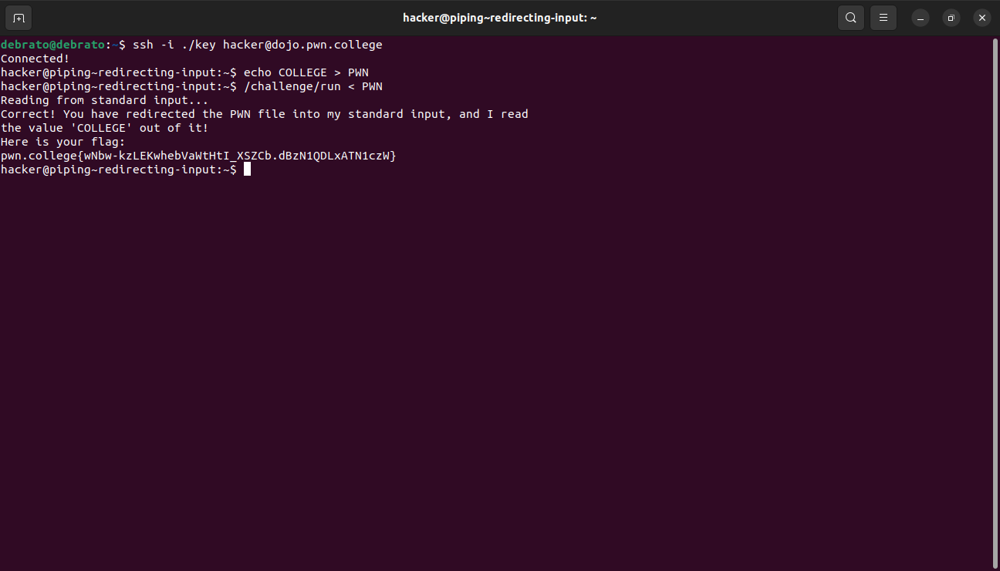

## Grepping stored results
In this challenge we had to use mixed concept then previous knowledge of grep, i was first stuck because i was searching for flag then i remembered that all flags begin with pwn.college then I got the flag.
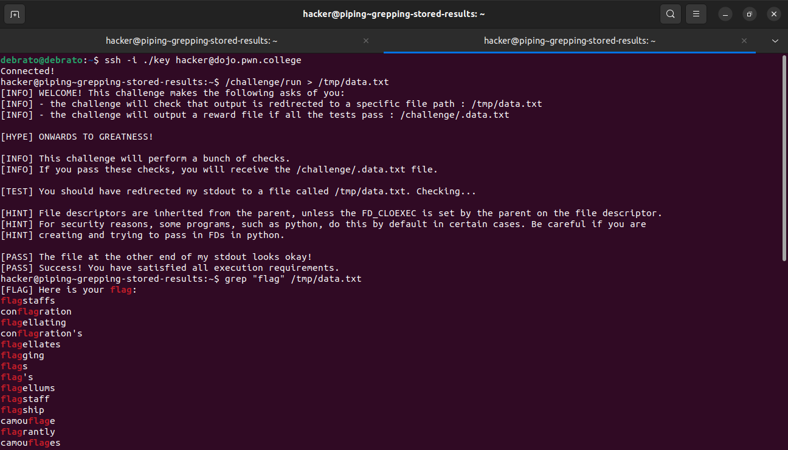
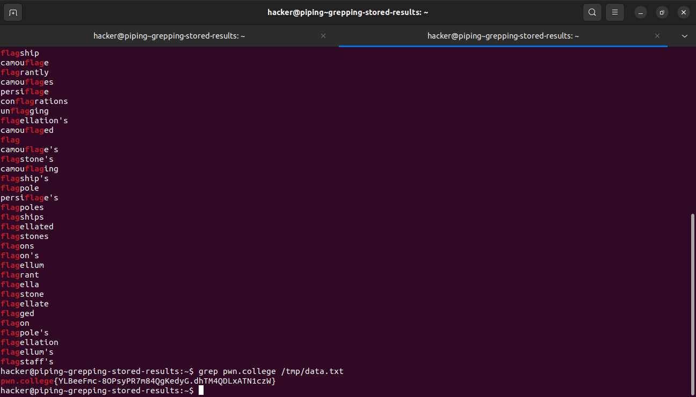

## Grepping live output
This challenge taught me to use | I already knew about it a bit in basic, it made it easier to do the previous challenges.
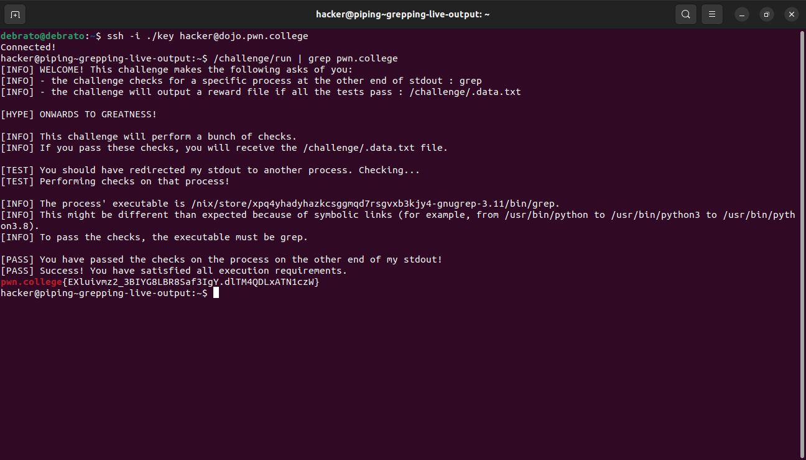

## Grepping errors
This challenge also used same previous concepts, just here had an error file too.
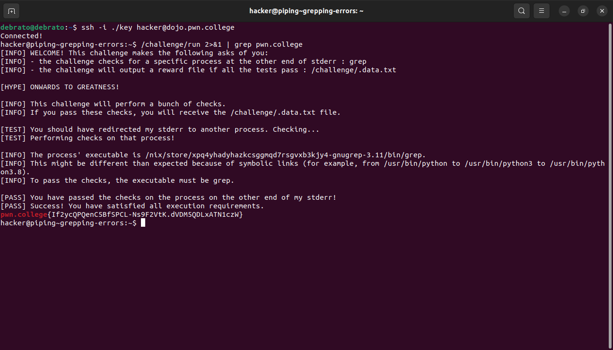

## Duplicating piped data with tee
In this challenge i learn about tee command, Tee can be used to duplicate the output data of command while its being piped to a different command.In this challenge we have to pipe the /challenge/pwn which contains a secret code to /challenge/college
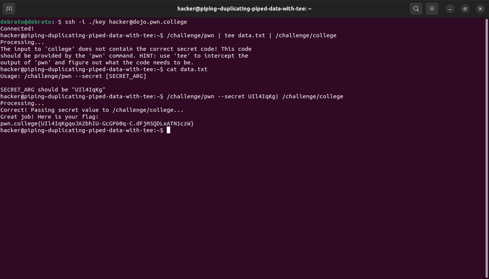

## Writing to multiple programs
We can redirect the stdout of a command to stdin of multiple programs using >() function. We can use tee to redirect the stdout to >(/challenge/the) and redirect the other copy to /challenge/planet as stdin.
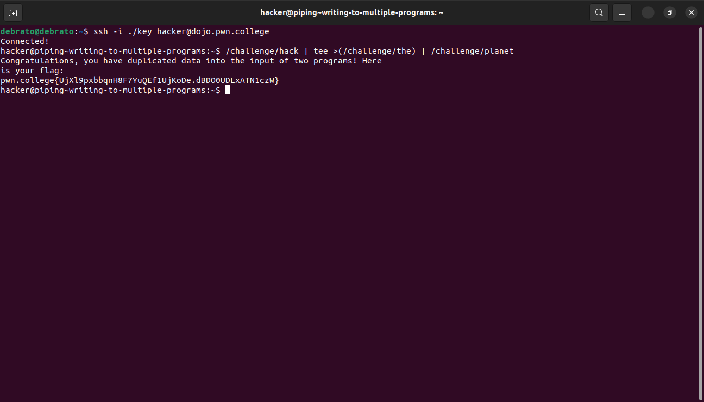

## Split-piping stderr and stdout
This was a god challenge. Tee can be used to duplicate the output data of command.
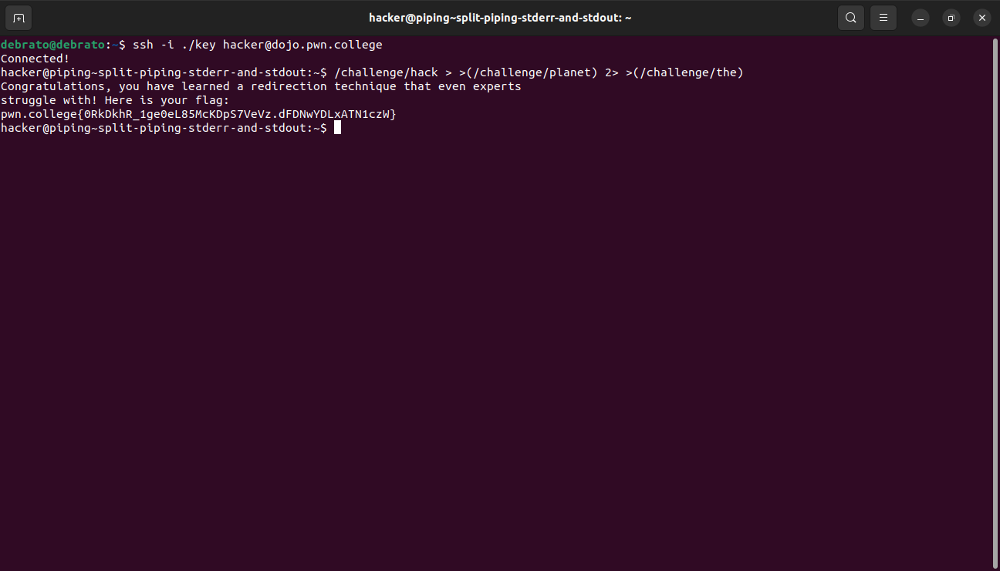

