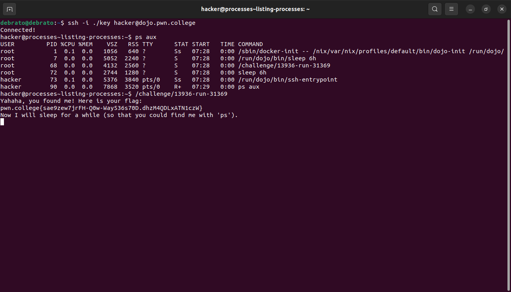
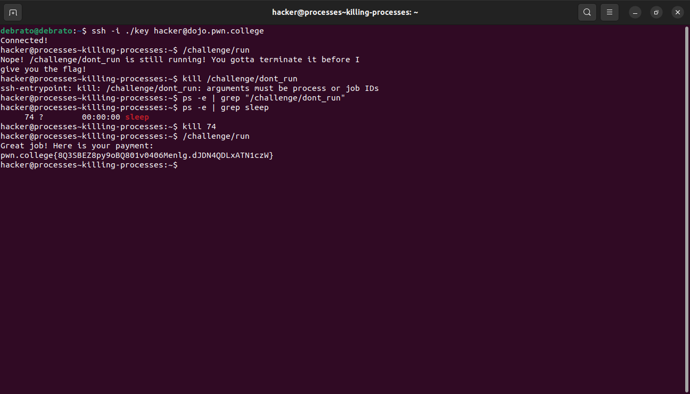
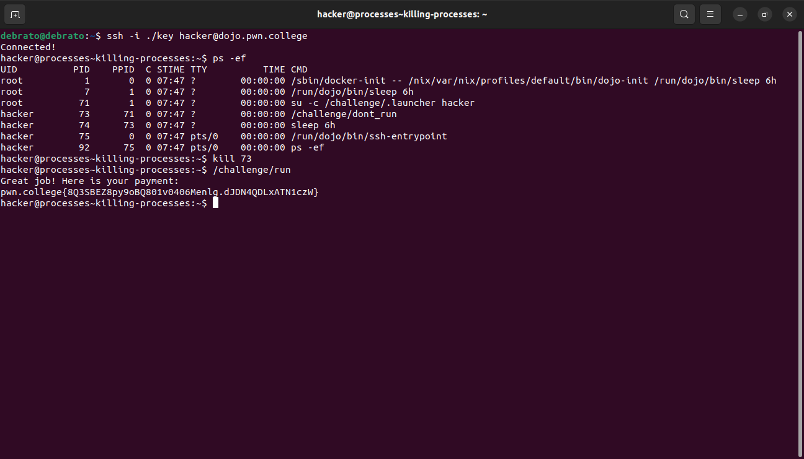
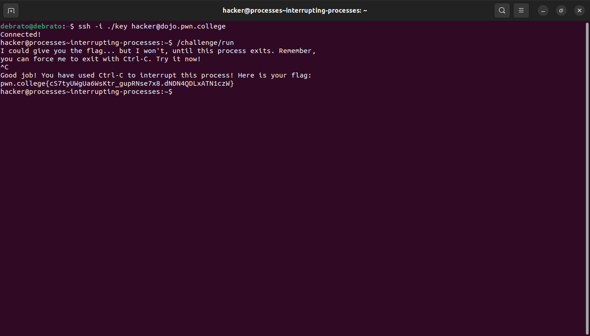
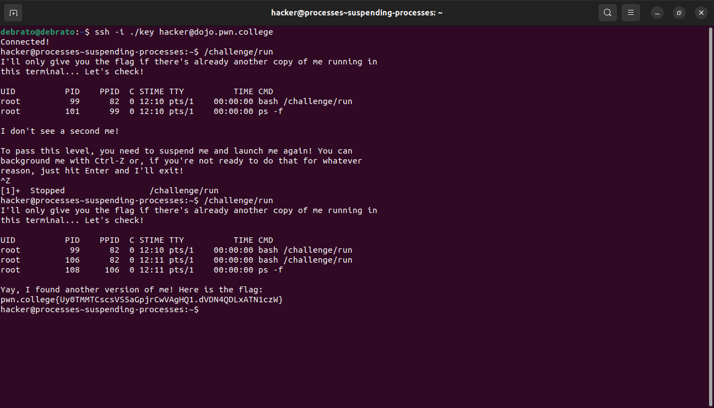
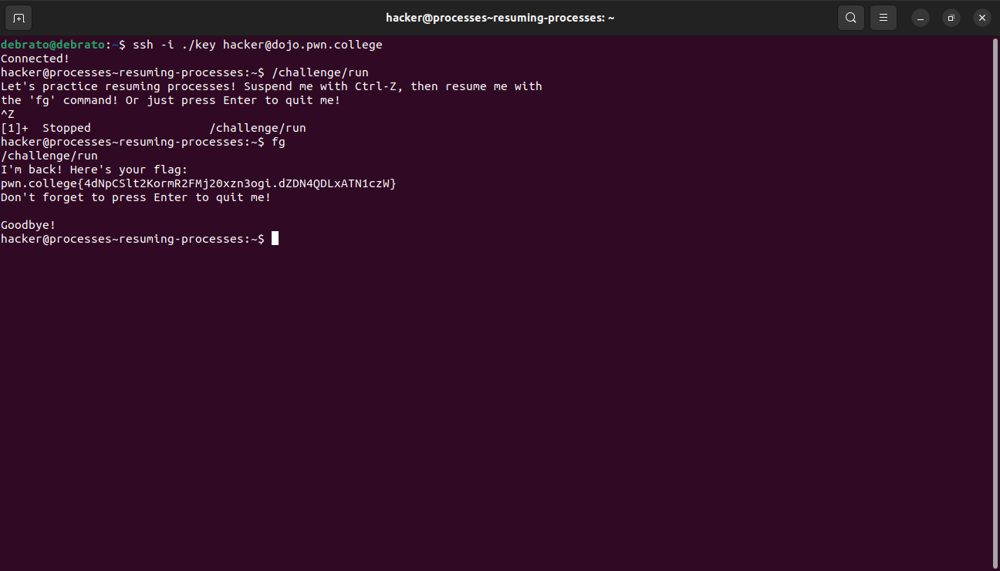
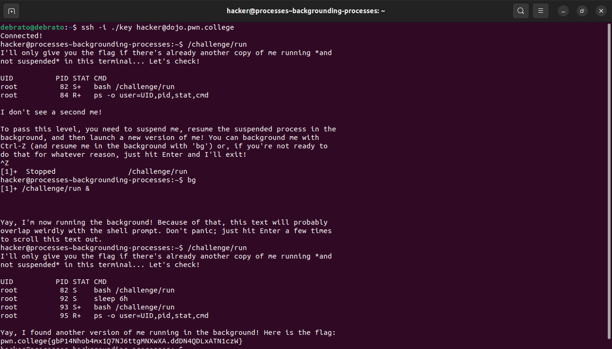
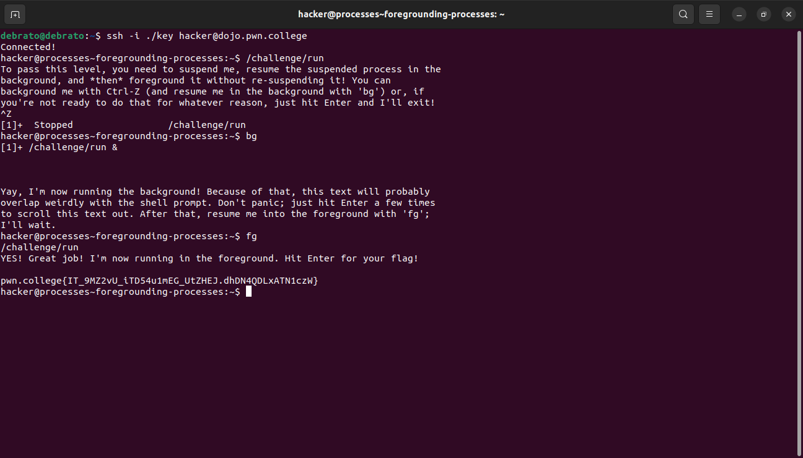
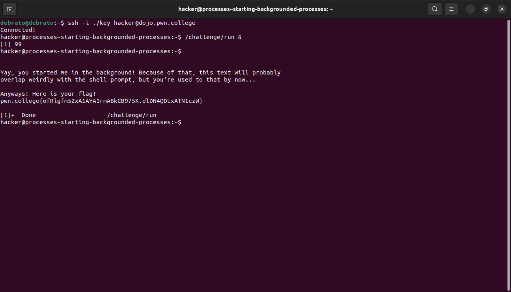
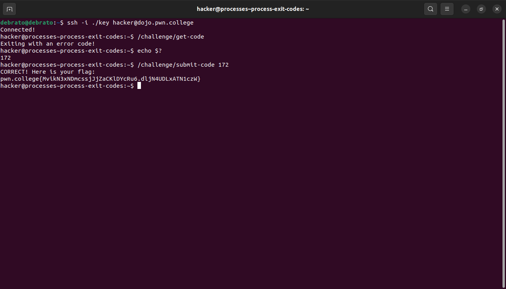

# Processes and Jobs
This is my eighth module. I dont know much about processes and jobs. In this module, we will learn to view and interact with processes in a number of exciting ways.

## Listing Processes
This challenge was simple I just had to use ps eith -ef or aux to get different proccesses and identify the flag containing path and then invoking it.

## Killing Processes
In this chalenge I was first trying to search the command name I wasnt getting so I randomly searched sleep because of the given example, it gave me the flag buut the correct method was to first see through the output of ps and then see the pts.

## Interrupting Proccesses
In this challenge  i just had to interrupt the terminal after invoking the given path.

## Suspending Processes
In this chalenge I learnt about suspending challenges using ctrl+z, i had to invoke the function first then suspend it then again invoke the new function while its copy remains in the background.

## Resuming Processes
In this challenge I learn to use the fg command which is used to resume a suspended process.

## Backgrounding Processes
In this cahllenge I got to know about the bg command, This level's run wants to see another copy of itself running, not suspended, and using the same terminal. How? Use the terminal to launch it, then suspend it, then background it with bg and launch another copy while the first is running in the background.

## Foregrounding Processes
In this challenge I got to know that we can foreground a background process using fg.

## Starting Backgrounded Processes
In this challege I just had to run the process in background using &.

## Process Exit Codes
This challenge taught me about exit codes success is 0 and failure is most commonly 1 but sometimes an error code that identifies a specific failure mode. We can access the exit code of the most recently-terminated command using the special ? variable. 

