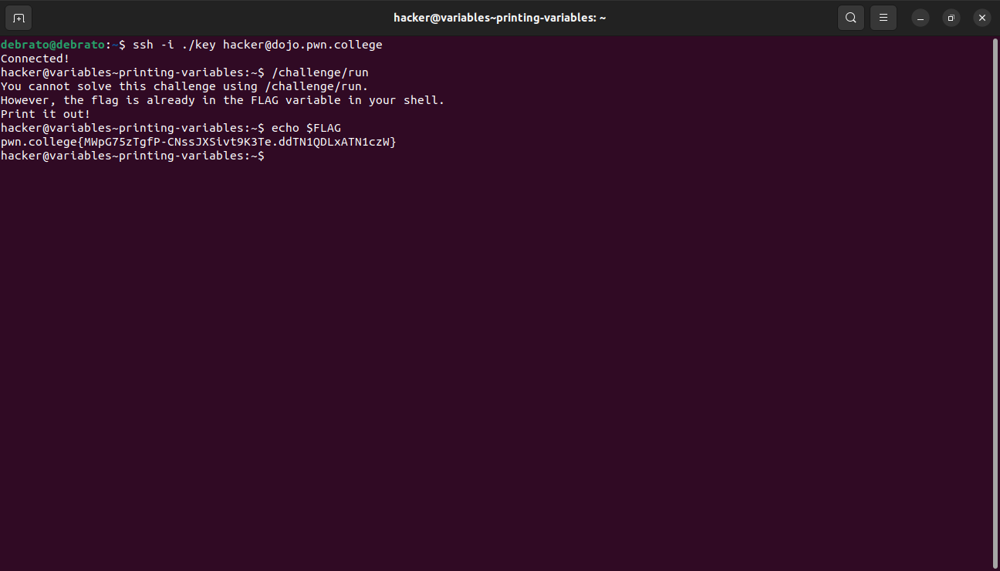
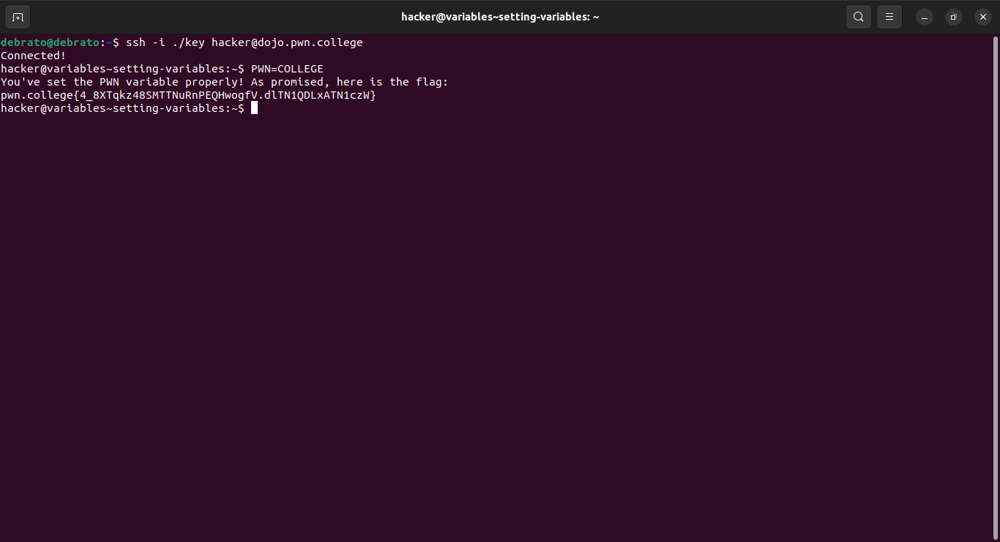
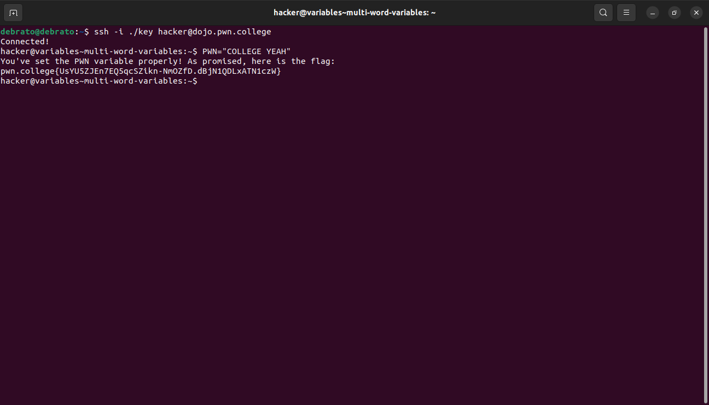
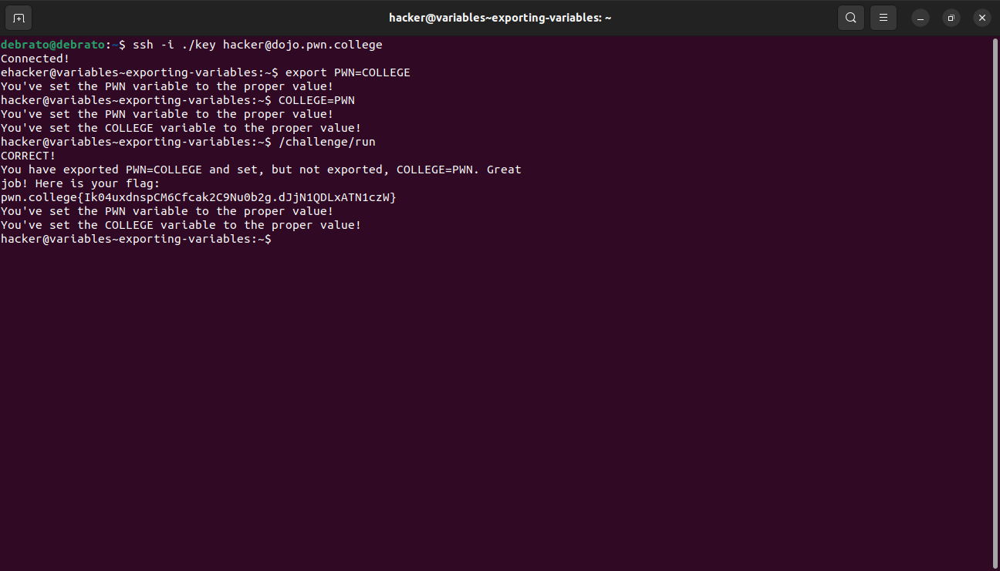
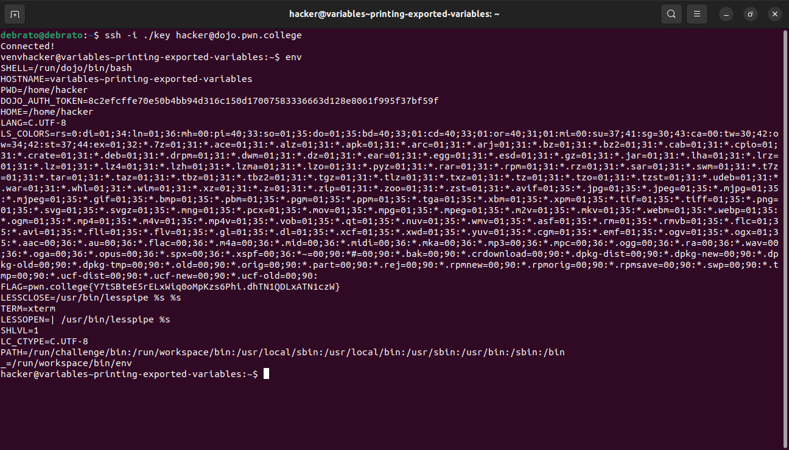
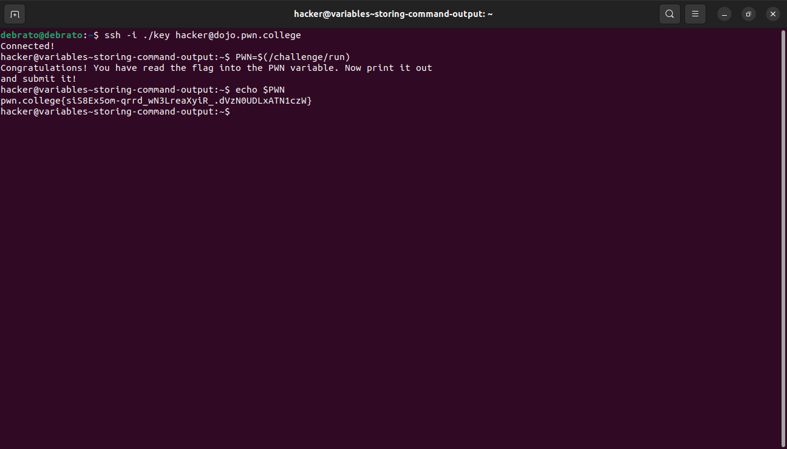
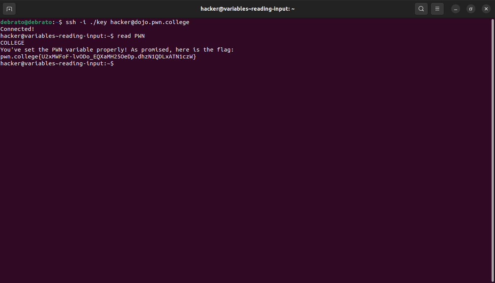
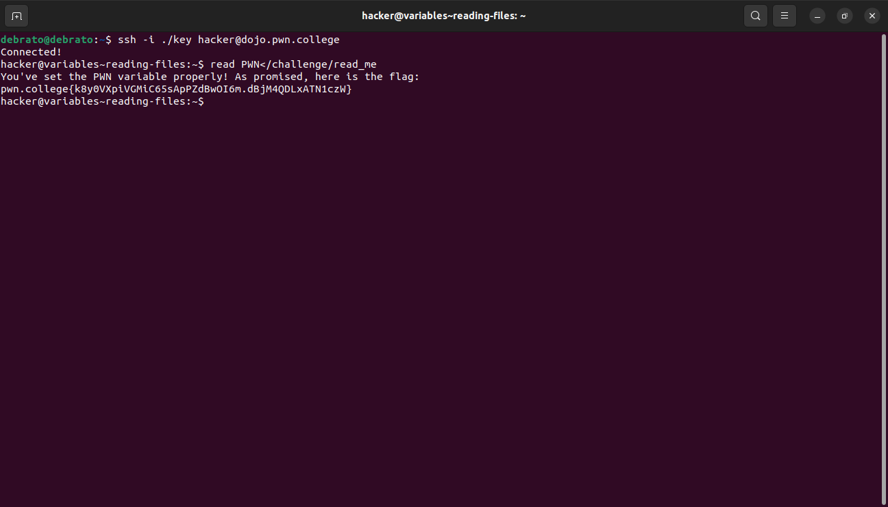

# Shell Variables
This is my seventh module. I took plenty time before my first module to learn about the unix command line after dualbooting linux so this too was kind of easy for me, only sometimes the wording of the instructions was confusing.

## Printing Variables
In this chalenge i just had to print a variable flag using echo command, we need to use $ before the variable to print.

## Seting Variables
In this challenge i didnt even have to use echo to print the variable just i had to store a value in a variable.

## Multi-word Variables
In this challenge i had to use "" for multi word inputs for the variables.

## Exporting Variables
In this challenge i learnt about the export command. In this challenge I had to store value in one exported variable and one normally then invoke a given path.

## Printing Exported Variables
In this chalenge I learnt about the env command: it'll print out every exported variable set in the shell, then I had to find the flag variable.

## Storing Command Output
In this challenge I just had to read the output of the /challenge/run command directly into a variable called PWN and then use echo command to read it.

## Reading Input
In this challenge I just had to use read to set the PWN variable to the value COLLEGE

## Reading Files
In this challenge we just had to read /challenge/read_me into the PWN environment variable using a single command, prety simple just use read command and redirect the path to the stdin of read.

