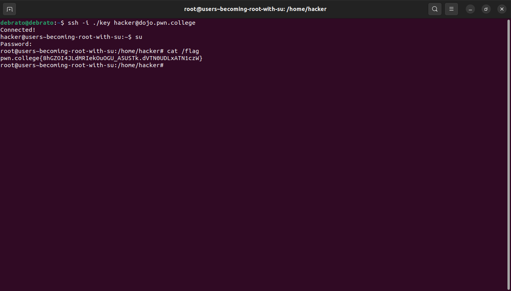
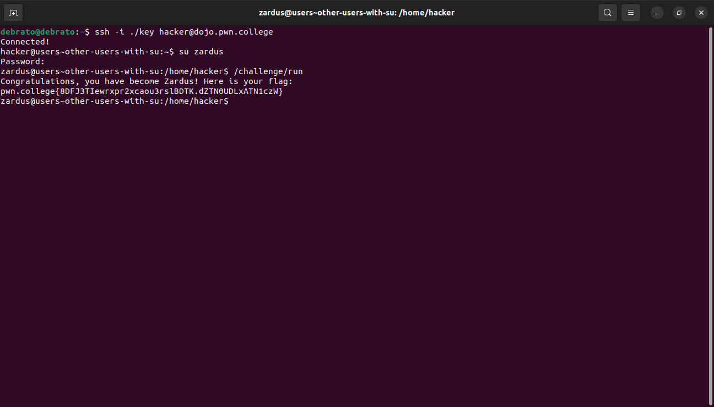
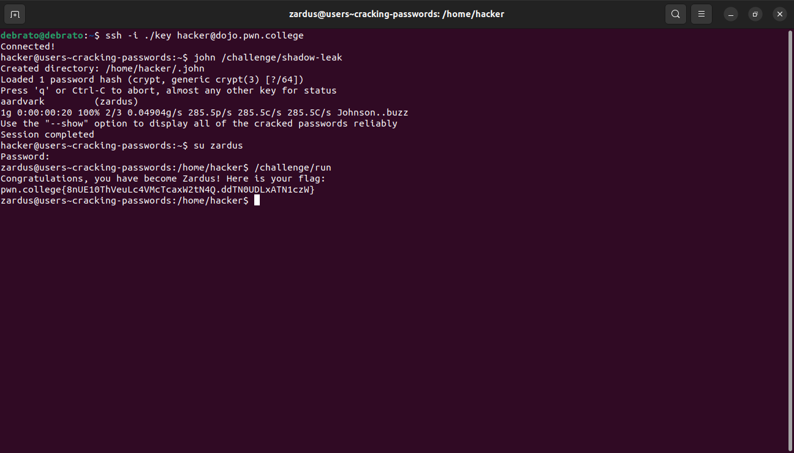
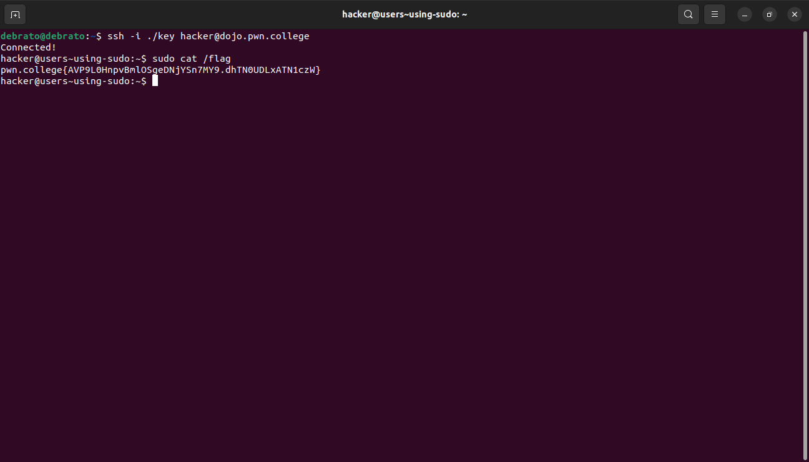

# Untangling Users
This is my tenth module. I dont know much about Untangling Users. Till now its been easy to learn even the new things lets see how this
 module goes.

## Becoming root wit su
In this challenge I just had to become the root user using su command and givint the root password.

## Other users with su
In this challenge I had to use su to change user.

## Cracking passwords
Usually the passwords are hashed and stored in files which are protected by root access however sometimes leaks also occur which can be unhashed using john the ripper . For this challenge we first john /challenge/shadow-leak to get the password of zardus after which su zardus and run /challenge/run.

## using sudo
This challenge taught me to use sudo and how it doesnt open a shell to the user like su but gives root access to commands.

